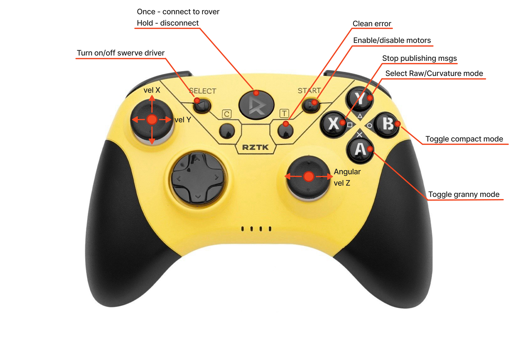

# Joystick

The joystick connects to the Jetson either over USB or over Bluetooth.

| Method | When to use |
|--------|-------------|
| USB cable | Default, especially during field operation |
| Bluetooth dongle | When a cable is impractical |

## USB Connection

Plug **USB-A** into the Jetson and **USB Type-C** into the joystick. No further setup is needed.

## Bluetooth Connection

1. Plug the Bluetooth dongle into the USB hub.

   > ⚠️ Unplug the dongle before rebooting — the Jetson will not boot with it attached.

2. If the joystick is not paired yet, pair it with `bluetoothctl`:

   ```bash
   bluetoothctl
   ```

   | Command | Purpose |
   |---------|---------|
   | `scan on` / `scan off` | Start / stop discovery of nearby devices |
   | `pair <mac-address>` | Pair with the joystick |
   | `connect <mac-address>` | Connect to a paired joystick |
   | `remove <mac-address>` | Forget the device (use before re-pairing) |

3. Toggle the power button on the joystick — it connects automatically.

## Joystick Layout



## Light Bar

On a PlayStation controller, `joystick_interpreter` paints the light bar with the current drive state. The colours are ordered by severity — the bar always shows the most serious state that applies, so green means the joystick can move the rover *right now*:

| Color | Meaning |
|-------|---------|
| 🔴 Red | Motors off — hardware inactive |
| 🟣 Magenta | Motor faults cleared — cycle the motor button to re-enable |
| 🟠 Orange | Motors on, controller inactive |
| 🔵 Blue | Yielding to navigation |
| 🟢 Green | Joystick in command |

Magenta appears after the clear-errors button: the faults are gone, but the hardware will not drive again until the motor button is cycled off and on.

### Setup

The light bar is exposed by the kernel's `hid-playstation` driver under `/sys/class/leds/` and is root-owned by default. A udev rule hands it to the `plugdev` group so the node can write to it without running as root:

```bash
# On the Jetson, over SSH
./scripts/setup_host.sh rover --joystick-led

# On this machine
./scripts/setup_host.sh local --joystick-led
```

Two requirements are easy to miss:

- **The user running the node must be in `plugdev`.** The udev rule only sets the group; it cannot add anyone to it. Check with `id -nG`, and if needed:

  ```bash
  sudo usermod -aG plugdev "$USER"    # log out and back in for it to take effect
  ```

- **Run the setup on the host, not inside the development container.** udev rules belong to the host kernel; a container has its own `/etc/udev` that nothing ever reads. `system/setup.sh` now refuses to run inside a container rather than reporting a success that configured nothing. From a distrobox shell, reach the host explicitly:

  ```bash
  distrobox-host-exec ./scripts/setup_host.sh local --joystick-led
  ```

To confirm the rule took effect, plug the controller in and check that the group is `plugdev` and the file is group-writable:

```bash
ls -l /sys/class/leds/*:rgb:indicator/multi_intensity   # DualSense
ls -l /sys/class/leds/*:{red,green,blue,global}/brightness   # DualShock 4
```

### Supported controllers

Both light-bar shapes the `hid-playstation` driver exposes are handled:

| Controller | sysfs layout |
|------------|--------------|
| DualSense (PS5) | one multicolor LED, `*:rgb:indicator/multi_intensity` plus `brightness` |
| DualShock 4 (PS4) | separate `*:red` / `*:green` / `*:blue` LEDs plus a `*:global` gate |

`brightness` is written as well as the colour: the light bar's output is intensity × brightness, and the driver resets brightness when a controller reconnects, so setting the colour alone can leave the bar dark.

> **Note:** Controllers with no light bar (e.g. Xbox pads) are skipped silently — this is a normal setup, not an error. A light bar that *is* found but cannot be written is logged as a warning, since that means the udev rule or `plugdev` membership is missing.
