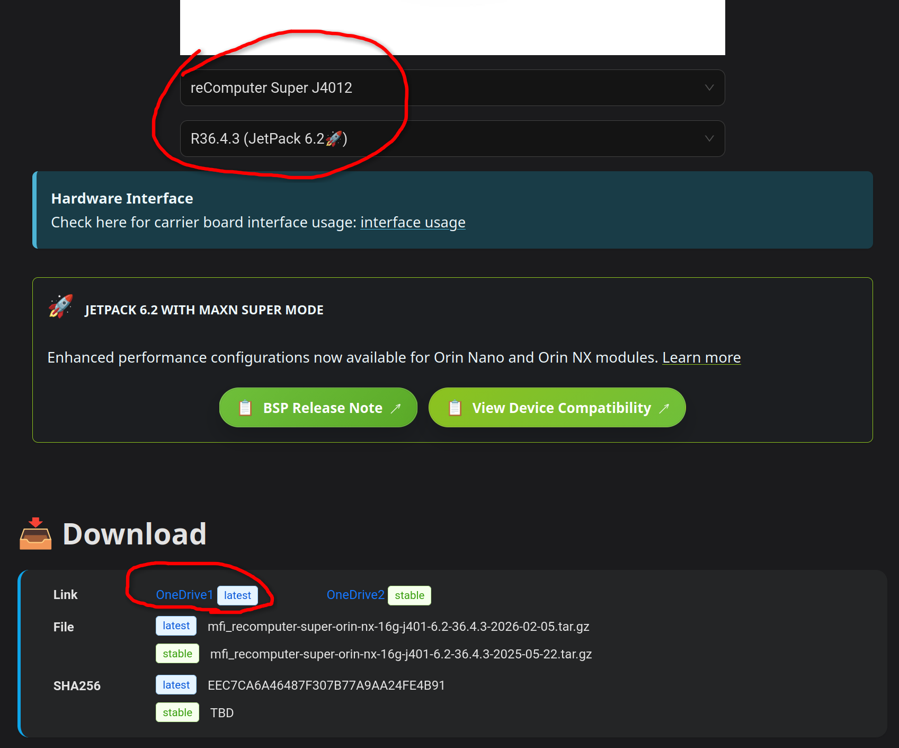

# J4012 Flashing Notes

Disclaimer:
> We had A LOT of troubles with flashing firmware to Jetson Orin NX 16gb (J4012 Super) that we posses.
> We barely made it after 5 hours for 2 days of continues debug and errors.
> Maybe not every step from these notes is nesseccary, not every flag is required and does stuff,
> but somehow it worked.

## Steps for flashing firmware

### 1. Ubuntu 20/22/24

I scipped this but instructions strongly suggest to have native Ubuntu 22/24 for the next steps. I tried in distrobox Ubuntu 22/24 and had the same errors as on host Ubuntu 26. And when I fixed those errors I succeded on my host Ubuntu 26. So I would recommend to use host because you need to have some servers running on host OS.

### 2. **Download right Jetpack for our PC**

Download from [this site](https://wiki.seeedstudio.com/flash/jetpack_to_selected_product/).

Select that it's `reComputer Super J4012` and `R36.4.3 (Jetpack 6.2)` right below.

And start download by clicking `OneDrive1` latest or stable, doesn't matter exactually since it's the same link.



### 3. **Go to Download folder and extract content from tar.gz**

```bash
cd ~/Downloads
sudo tar xpf mfi_recomputer-super-orin-nx-16g-j401-6.2-36.4.3-2026-02-05.tar.gz
```

### 4. Start NFS server on host

Insert from AI:


    The problem: the flash tool boots a small initrd on the Jetson and serves the partition images to it over NFS. Your host has the nfs-kernel-server userspace, but the message Not starting NFS kernel daemon: no support in current kernel means the NFS server kernel module isn't loaded or isn't available.

    Fix on the host (not in the container — the kernel is the host's):

    ```bash
    sudo apt install -y nfs-kernel-server
    sudo modprobe nfsd
    sudo modprobe nfs
    lsmod | grep nfsd
    ```

    lsmod must show nfsd. Then start the service:

    ```bash
    sudo systemctl enable --now nfs-server
    sudo systemctl status nfs-server
    sudo exportfs -ra
    showmount -e localhost
    ```


### 5. Problem that I had for a long with NFS

```bash
Waiting for target to boot-up...
Waiting for target to boot-up...
Waiting for target to boot-up...
Waiting for target to boot-up...
Waiting for target to boot-up...
Waiting for target to boot-up...
Waiting for target to boot-up...
Waiting for target to boot-up...
Waiting for target to boot-up...
Waiting for device to expose ssh ......Waiting for device to expose ssh ...Run command: flash on fc00:1:1:0::2
SSH ready
mount.nfs: Stale file handle
Flash failure
Either the device cannot mount the NFS server on the host or a flash command has failed. Check your network setting (VPN, firewall,...) to make sure the device can mount NFS server. Debug log saved to /tmp/tmp.D0ZfBZyy3e. You can access the target's terminal through "sshpass -p root ssh root@fc00:1:1:0::2" 
Cleaning up...
```

Fix for it is to clean and restart NFS exports `/etc/exports`.

```bash
❯ cat /etc/exports
# /etc/exports: the access control list for filesystems which may be exported
#		to NFS clients.  See exports(5).
#
# Example for NFSv2 and NFSv3:
# /srv/homes       hostname1(rw,sync,no_subtree_check) hostname2(ro,sync,no_subtree_check)
#
# Example for NFSv4:
# /srv/nfs4        gss/krb5i(rw,sync,fsid=0,crossmnt,no_subtree_check)
# /srv/nfs4/homes  gss/krb5i(rw,sync,no_subtree_check)
#
```
It should contain only these comments, no exports for it.

```bash
sudo nano /etc/exports  # delete the three mfi_recomputer lines
sudo exportfs -ua       # drop everything currently exported
sudo exportfs -f        # flush the kernel cache
sudo exportfs -ra       # rebuild from the (now clean) config
sudo exportfs -v        # should be empty or show only what you want
```

### 6. Run script

```bash
cd ~/Downloads/mfi_recomputer-orin-super-j401
```

```bash
sudo ./tools/kernel_flash/l4t_initrd_flash.sh --flash-only --massflash 1 
```