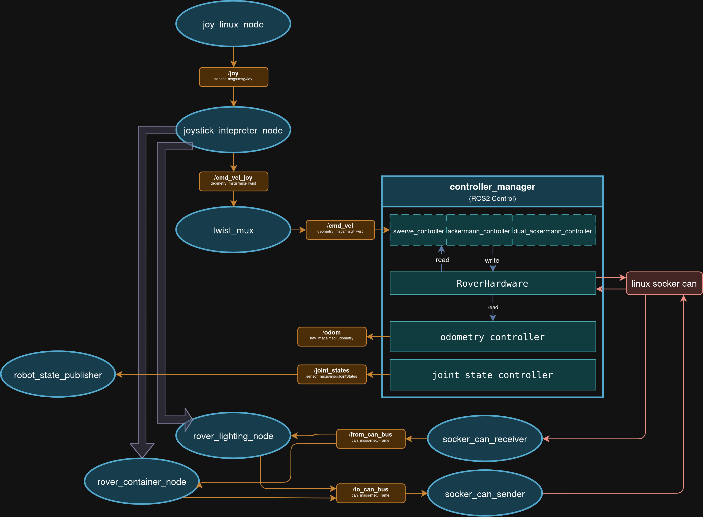

# Graph

> *not full, needs improvements*

# Packages

## 1. `indomitus_interfaces`
Custom ROS2 messages, services, and actions used across all packages.

**Messages:**
- **`ChassisStatus`** — complete status report from all motors
- **`MotorStatus`** — individual motor state (kinematic and electrical data)

**Services:**
- `GetWeight`, `SetSteerZero`, `SetTrafficLight`

**Actions:**
- `ContainerLid`

---

## 2. `rover_hardware_interface` (C++)
ros2_control `SystemInterface` plugin responsible for low-level communication with motors over CAN bus.

Communicates with two motor types:
- **Steer Motors (Steadywin V3.06b0):** 4 motors (IDs: 11, 13, 15, 17)
- **Drive Motors (Damiao J10010):** 4 motors (IDs: 10, 12, 14, 16)

**Protocols:** `damiao_protocol.hpp`, `steadywin_protocol.hpp`

Loaded as a ros2_control hardware plugin (`rover_hardware_interface/RoverHardwareInterface`) via `rover_description/urdf/rover.ros2_control.xacro`, conditionally on `use_sim:=false` — no standalone node or launch file.

**Tests:** `test/test_protocols.cpp`

---

## 3. `rover_controller` (C++)
ros2_control controller plugins implementing swerve-drive kinematics and odometry.

**`swerve_controller_test` is the swerve controller.** It is the only one launched, on hardware and in simulation. `swerve_controller` is kept in the tree — plugin, source and parameter blocks — purely as a regression fallback, not as a runtime alternative: the two are never spawned together and are never switched between while running.

- **`swerve_controller_test`** — receives `geometry_msgs/Twist` on `/cmd_vel` and computes per-wheel velocity and steering angle targets, smoothing the twist as *shape + magnitude* rather than vx/vy/wz separately, so a throttle change leaves the steering angles alone. Also reads the drive joints' velocity state, which it uses to detect a real standstill. On hardware it is spawned **inactive** and `drive_power_node` activates it when the drive is powered, from either operator (`controller_name` in `rover_teleop/config/drive_power.yaml`); that ordering is deliberate, since it makes the controller seed its steering integrator from live encoder readings rather than from placeholder zeros. In simulation it is spawned active.
- **`swerve_controller`** — the controller it replaced, retained in case a regression sends us back to it. Falling back is a launch-time change, never a runtime one: in simulation, `ros2 launch rover_sim sim_gz.launch.py swerve_controller:=swerve_controller`; on hardware, an edit to `rover.launch.py`.
- **`odometry_controller`** — reads wheel feedback and publishes odometry
- **`ackermann_controller`** *(planned)* — Ackermann steering with fixed rear wheels, only front wheels steer
- **`dual_ackermann_controller`** *(planned)* — Ackermann steering with symmetric front and rear wheel steering

Loaded as plugins via `controllers.yaml` (one copy in `rover_bringup/config` for real hardware, one in `rover_sim/config` for simulation), spawned by `rover_bringup/launch/control.launch.py` — not launched directly.

---

## 4. `rover_bringup`
Main launch and configuration package for the real rover.

**Launch files:**
- `rover.launch.py` — top-level real-hardware bringup; composes `can.launch.py`, `rover_description`'s `robot_state_publisher.launch.py`, `control.launch.py`, `twist_mux.launch.py`, `rover_teleop`'s `drive_power.launch.py`, plus includes from `rover_peripherals` and `rover_localization`. Also conditionally includes `rover_sensors`' `zed2i.launch.py` via the `zed2i_mode` argument (`rgb`/`nav`/unset — unset skips launching the camera entirely, e.g. for test runs where it isn't connected)
- `can.launch.py` — configures and brings up the CAN bus interface
- `control.launch.py` — shared controller-manager/spawner logic; used by both `rover.launch.py` (real) and `rover_sim/launch/sim_gz.launch.py` (sim), toggled via a `use_sim` argument
- `twist_mux.launch.py` — velocity command multiplexer
- `power_monitor.launch.py` — brings up power monitoring (pairs with `rover_peripherals`' power node)

**Config:**
- `controllers.yaml` — ros2_control controller parameters (real hardware)
- `twist_mux.yaml` — velocity command multiplexer config

**Python module:**
- `rover_bringup/launch_utils.py` — shared launch-file helpers (e.g. `include_launch`) used across packages

> Note: `joy.launch.py` and `container.launch.py` now live in `rover_teleop` and `rover_peripherals` respectively, not here.

---

## 5. `rover_description`
URDF/xacro robot description files and 3D meshes. Sim/real-agnostic — differences are handled via xacro arguments rather than separate files.

**URDF:**
- `rover.xacro` — top-level entry point; declares shared args (`use_sim`, `can_interface`) and includes the pieces below
- `rover.urdf.xacro` — physical robot description (links, joints, meshes, inertials)
- `rover.ros2_control.xacro` — `<ros2_control>` hardware definitions for both sim (`gz_ros2_control/GazeboSimSystem`) and real (`rover_hardware_interface/RoverHardwareInterface`), branched via `xacro:if`/`xacro:unless` on `use_sim`
- `camera.xacro` — camera link/sensor definition

**Launch files:**
- `launch/robot_state_publisher.launch.py` — shared `robot_state_publisher` launch, parameterized by `xacro_file`, `xacro_args`, and `use_sim_time`; used by both `rover_bringup/rover.launch.py` and `rover_sim/sim_gz.launch.py`

**Meshes:** suspension components (`rocker`, `wheel`, `wheel_mount`, `central_axii`), plus arm, navigation, and science subfolders.

---

## 6. `rover_teleop` (Python)
Teleoperation nodes.

- **`joystick_interpreter_node`** — maps raw joystick input (`sensor_msgs/Joy`) to `Twist` commands on `/cmd_vel` (remapped to `/cmd_vel_joy`). Owns only what shapes its own twist: strafe, granny, curvature vs raw twist, and whether it is publishing at all. Its buttons are momentary, so everything else they touch is a `Trigger` call asking an owner to invert state — `drive_power_node` for the drive, `lights_can_node` for the lights. Paints the controller light bar from `drive/state`, and publishes `teleop/joystick_active` so the ground station can see when this node is holding the mux.

  When `/joy` goes stale it publishes a short burst of zeros (`timeout_zero_burst`, default 3) and then **stops publishing**. `cmd_vel_joy` has the highest priority in twist_mux, so a node that kept publishing zeros would hold that priority forever and lock the ground station out of a rover nobody is driving.

- **`drive_power_node`** — owns motors, swerve-controller activation, compact mode, and the post-clear-errors inhibit, and publishes them latched on `drive/state`. Each is offered twice: `SetBool` for the ground station's latching switches, `Trigger` on `.../toggle` for the joystick's momentary buttons. `drive/power` does the hardware-component transition and the controller switch as one operation, so no caller has to sequence them.

  Launched from `rover_bringup/launch/rover.launch.py`, **not** from `joy.launch.py`: the ground station has to be able to power the drive with no gamepad plugged into the rover.

| Service | Type |
|---|---|
| `/drive/power` | `std_srvs/SetBool` |
| `/drive/power/toggle` | `std_srvs/Trigger` |
| `/drive/compact` | `std_srvs/SetBool` |
| `/drive/compact/toggle` | `std_srvs/Trigger` |
| `/drive/clear_errors` | `std_srvs/Trigger` |

**Launch files:**
- `launch/joy.launch.py` — launches the joystick driver + interpreter stack
- `launch/drive_power.launch.py` — the drive power owner (included by rover bringup)

**Config:**
- `config/joy.yaml` — joystick driver config
- `config/drive_power.yaml` — controller name, hardware component, clear-errors service

---

## 7. `rover_peripherals` (Python)
Nodes for non-drivetrain devices mounted to the rover body.

- **`rover_container_node`** — controls the sample container mechanism (communicates over CAN, config: `container_can.yaml`)
- **`rover_lighting_node`** — controls rover lighting
- **`rover_power_node`** — power (voltage/current) monitoring via CAN bus; decodes per-sensor CAN frames and republishes as `sensor_msgs/msg/BatteryState` (config: `power_node.yaml`)

**Launch files:**
- `launch/container.launch.py`
- `launch/lighting.launch.py`
- `launch/power_monitor_node.launch.py`

---

## 8. `rover_localization`
State estimation.

- **`ekf_node`** (from `robot_localization`) — sensor fusion for odometry, config `config/ekf_filter.yaml`

**Launch files:**
- `launch/ekf.launch.py` — included by both `rover_bringup/rover.launch.py` (real) and `rover_sim/sim_gz.launch.py` (sim), with `use_sim_time` set accordingly

---

## 9. `rover_sim` (C++)
Gazebo simulation support.

**Launch files:**
- `launch/sim_gz.launch.py` — top-level sim bringup; spawns Gazebo, includes `robot_state_publisher.launch.py` (with `use_sim:=true`), bridges Gazebo↔ROS2 topics, spawns the robot entity, and includes `control.launch.py` (with `use_sim:=true`)

**World:**
- `worlds/world_demo.sdf`

**Config:**
- `config/bridge_gz.yaml` — template for `ros_gz_bridge` topic mappings (rendered per-world/model at launch time)
- `config/controllers.yaml` — ros2_control controller parameters (sim variant)

**Controllers:**
- **`rocker_diff_controller`** — simulates passive differential bar suspension behaviour

---

## 10. `rover_viz`
Visualization tooling.

**Launch files:**
- `launch/rviz.launch.py` — RViz visualization
- `launch/power_monitor_viz.launch.py` — brings up PlotJuggler for live power monitoring, loading `plotjuggler/power_monitor.xml`

**Config:**
- `rviz/robot.rviz`
- `plotjuggler/power_monitor.xml` — PlotJuggler layout (voltage/current plots per sensor)

---

## 11. `arm/` — Robotic Arm Subsystem
> *New subtree — descriptions below are inferred from package/file names only; please confirm and expand.*

- **`arm_bringup`** — top-level arm launch (`arm_standalone.launch.py`)
- **`arm_description`** — arm URDF/xacro (`arm_macro.xacro`, `arm_standalone.urdf.xacro`) and meshes (base, forearm, mount, shoulder, wrist_1, wrist_2, jaw_gripper)
- **`arm_hardware_interface`** — ros2_control hardware plugin for the real arm (`plugins.xml`)
- **`arm_moveit_config`** — MoveIt2 configuration: SRDF, kinematics, joint limits, controllers, Servo config; launch files for `move_group`, RViz, controller spawning, virtual joint TFs, setup assistant, warehouse DB
- **`arm_sim`** — simulation support for the arm (structure only; no launch/config files yet)
- **`arm_tasks`** (Python) — `teach_poses`, `keyboard_servo_node` / `gamepad_servo_node`
- **`arm_viz`** — RViz config for the arm (`rviz/arm.rviz`)

---
